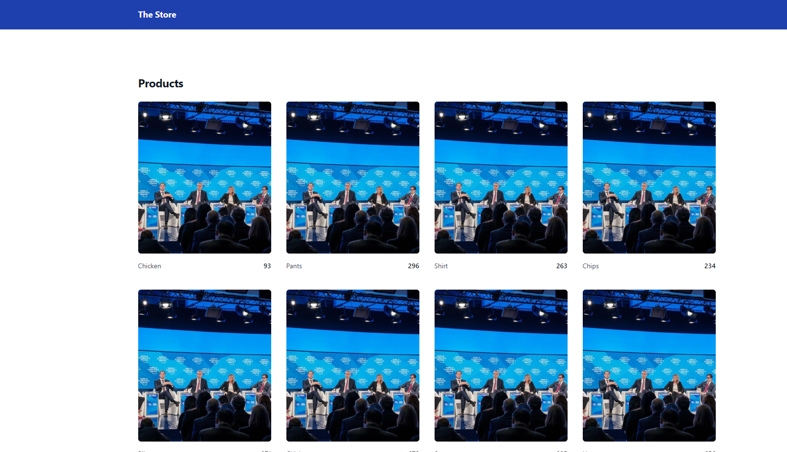
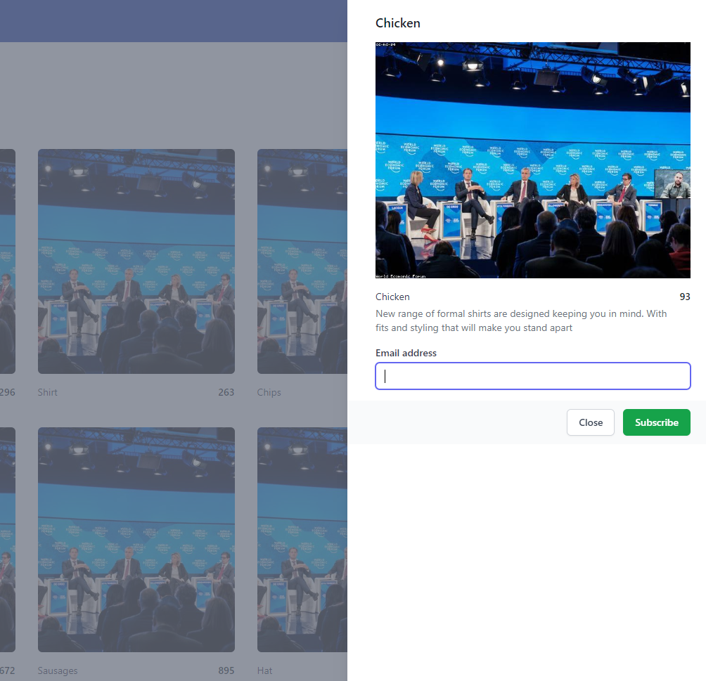
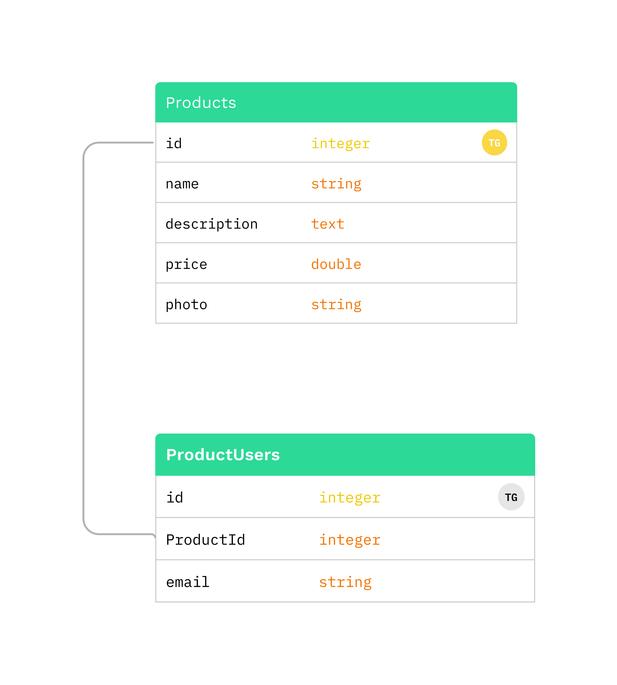

# The Store with event driven mail queue test

This is a simple sample project to show how I do resolve the situation provided by Stay Tuned challenge.

## Build

In order to keep things pretty simple, I created a makefile for this application.
So, if you have docker in your machine, and the tooling for make is in machine, you just need to run `make`.

If you want to use the npm scripts to build, just run `npm start`.

There are other npm scripts described in the root package.json file. Use these instead of the module specific ones.

## Step by step on how to run things

* Start the app (I suggest you using `make`).
* In the browser, access [http://localhost:8000](http://localhost:8000)


* Select one of the products


* Put your email in the email input and click subscribe

* Issue a request to `/api/product/:id` with the same product ID that you subscribed in the above steps, with a lowered price bigger than 10.
```json
{  
  "price": "This is an integer field, if the product costs 100, put 90, for example..."  
}
```

* In the browser, access [http://localhost:8080/](http://localhost:8080/). This is a SMTP client, it should have the email telling you that the price changed.

## Architectural assumptions

This is a monorepo project using the npm workspaces approach. If you don't know this approach, I strongly recommend you read about because it's a very clean and canonical way to define a monorepo.

The structure of the repo is:

* shared -> Where shared things live
* server -> The backend REST API
* mail-sender -> The event driven queue listener
* client -> The front end app

I choose postgresql as a database for this project and Redis to hold the queue state. 
The event driven approach is basically to use a Redis server to hold the enqueued job produced by some service and some other service listens to it.
It's a producer/consumer approach. In this case, we are using async functions and the producer will never be awaiting for the completion of the enqueue process, once the request should be completed as son as possible from the client perspective.

## Database design

The database design is very simple. Structured and we have a product table with a on to many relationship towards the ProductUsers table, where we have the user email.



## Application Modules

### Server

The server is a express js application that exposes a REST API with some endpoints,

#### Endpoints

**GET** `/api/product`
List all products

Object returned

```json
[
  {
    "id": 1,
		"name": "Chicken",
		"description": "The slim & simple Maple Gaming Keyboard from Dev Byte comes with a sleek body and 7- Color RGB LED Back-lighting for smart functionality",
		"photo": "https://loremflickr.com/640/480/food",
		"price": 306,
		"createdAt": "2022-11-24T19:44:02.579Z",
		"updatedAt": "2022-11-24T19:44:02.579Z"
  }
]
```
**PATCH** `/api/product/:id`
Patch a given product.

Params:
  id -> Product id

If the price is lowered more than the threshold, the application will produce an send email event for the subscribed users.

Body:

```json
{  
  "name": "Not required",
  "description": "Not required",
  "photo": "Not required",
  "price": "Not required (float)"  
}
```

Object returned

```json
{
  "id": 1,
  "name": "Chicken",
  "description": "The slim & simple Maple Gaming Keyboard from Dev Byte comes with a sleek body and 7- Color RGB LED Back-lighting for smart functionality",
  "photo": "https://loremflickr.com/640/480/food",
  "price": 306
}
```
**POST** `/api/product/:id/associate-user`
Subscribe an user email to a given product

Params:
  id -> Product id

Body:

```json
{  
  "email": "required (email)"
}
```

Object returned

```json
{
  "id": 1,
  "ProductId": 1,
  "email": "the@email"  
}
```

## Testing

There are only tests in the server application.
The approach is unit test, but if necessary it's possible to create e2e tests in both server and mail-sender modules.
The approach is basically, for small pure functions or methods, you can test the unity. For complex tests, e2e tests are more suitable.

## Other interesting stuff

I've used an SMTP application to show the email flow, this application is free and is pretty interesting to test email things.
To deploy the front end, I've used the ngnix. I really like nginx to do a lot of things. Also, the front end is made very simple, I know a lot more about React, Redux and front end related stuff. I choose to use webpack to build the application, once it's easier to manage dependencies from the npm workspaces perspective when you install things from the root.

The linter is to be used for all the modules.
Another interesting thing is the configs in webpack, all things that are possible to do with the esm approach are in esm. Other things are in .cjs files.
